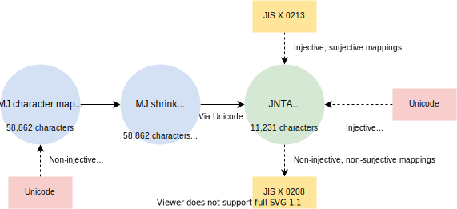
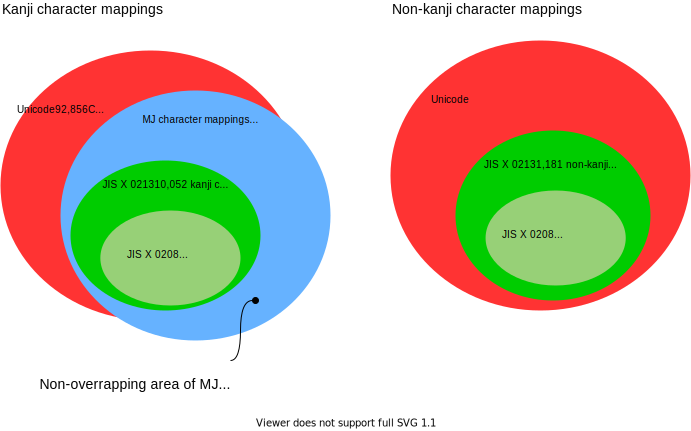

# jntajis-python

## What's JNTAJIS-python?

JNTAJIS-python is a transliteration library, specifically designed for dealing with three different character sets; JIS X 0208, JIS X 0213, and Unicode.

```python
import jntajis

print(jntajis.mj_shrink_candidates("髙島屋"))  # outputs ["高島屋", "髙島屋"]
print(jntajis.jnta_shrink_translit("麴町"))  # outputs "麹町"
```

To that end, this library refers to three different character tables; MJ character table, MJ shrink conversion map, and NTA shrink conversion map.

The MJ character table (*MJ文字一覧表*) defines a vast set of kanji (*漢字*) characters used in information processing of Japanese texts initially developed by Information-technology Promotion Agency.

The MJ shrink conversion map (*MJ縮退マップ*) was also developed alongside for the sake of interoperability between MJ-aware systems and systems based on Unicode, which is used to transliterate complex, less-frequently-used character variants to commonly-used, more-used ones.

The NTA shrink conversion map (*国税庁JIS縮退マップ*) was developed by Japan National Tax Agency to canonicalize user inputs for its corporation number search service provided as a public web API.  This maps JIS level 3 and 4 characters to JIS level 1 and 2 characters (i.e. characters defined in JIS X 0208.)  Note that not all level 3 and level 4 characters have level 1 and 2 counterparts.  Also note that some of level 3 and 4 characters don't map to a single character one by each.  Instead, they map to sequences of two or more characters.

The table below shows some examples of transliteration by the MJ character table suite and NTA shrink conversion map.

| Glyph | MJ code | Unicode | JIS X 0213 | Glyph\* | MJ code\* | JIS X 0208\* | Transliterator |
| ----- | ------- | ------- | ---------- | ------ | ------- | ---------- | -------------- | 
|  | MJ014031 | U+68C3 | 2-14-90 |  | MJ014007 | 1-45-92 | MJ / JNTA |
|  | MJ030196 | U+FA11 | 1-47-82 |  | MJ010541 | 1-26-74 | MJ / JNTA |
|  | MJ028902 | U+9AD9 | N/A |  | MJ028901 | 1-25-66 | MJ |

The conversion schematics is shown below:



* JNTA transliteration

    As every JIS X 0213 characters maps to its Unicode counterpart, the conversion is done only with the single JNTA character mappings table.

* MJ transliteration

    Transliteration is done in two phases:

    1. Conversion from Unicode to MJ character mappings.

        While not all characters in the MJ characters table map to Unicode, each MJ code has different shrink mappings. Because of this, the transliterator tries to convert Unicode codepoints to MJ codes first.

    2. Transliteration by MJ shrink mappings.

        The transliteration result as a string isn't necessarily single as some MJ codes have more than one transliteration candidate. This happens because a) a Unicode codepoint may map to multiple MJ codes and b) multiple transliteration schemes are designated to a single MJ code.


Relationship between Unicode, MJ character mappings, JIS X 0213, and JIS X 0208 can be depicted as follows:



## License

The source code except `src/jntajis/_jntajis.h` is published under the BSD 3-clause license.

`src/jntajis/_jntajis.h` contains the data from the following entities:

* JIS shrink conversion mappings (国税庁: JIS縮退マップ)

  Publisher: National Tax Agency

  Author: National Tax Agency

  Source: https://www.houjin-bangou.nta.go.jp/download/

  License: CC BY 4.0

* MJ character table (文字情報技術促進協議会: MJ文字一覧表)

  Publisher: Character Information Technology Promotion Council (CITPC)

  Author: Information-technology Promotion Agency (IPA)

  Source: https://moji.or.jp/mojikiban/mjlist/

  License: CC BY-SA 2.1 JP

* MJ shrink conversion mappings (文字情報技術促進協議会: MJ縮退マップ)

  Publisher: Character Information Technology Promotion Council (CITPC)

  Author: Information-technology Promotion Agency (IPA)

  Source: https://moji.or.jp/mojikiban/map/ 

  License: CC BY-SA 2.1 JP
